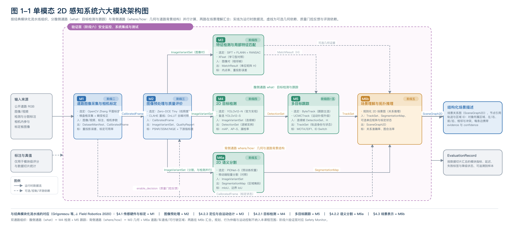

# 2DUPS · 单模态 2D 感知系统

《机器视觉》课程项目（2024 级）的工程仓库。目标是在**公开道路 RGB 图像 / 视频**上离线复现一条完整的单模态 2D 感知流程：从相机标定、图像预处理，到目标检测与多目标跟踪、语义分割与场景理解。

项目按领域经典的**模块化流水线**组织，并分为两条并行通路：**腹侧通路（what）**负责目标检测与跟踪，**背侧通路（where/how）**负责自车几何与道路背景结构；两路在场景理解汇合。阶段六作为验证层（对应经典架构中的 Safety Monitor）。

## 系统架构（图 1-1）

数据流：`输入 → M1 标定 → M2 预处理 →｛M3 几何 ∥ M4 检测 ∥ M6a 语义分割｝→ M5 跟踪 → M6b 场景理解 → 结构化场景描述`

| 模块 | 通路 | 选定模型 | 输出接口 |
|---|---|---|---|
| M1 道路图像采集与相机标定 | — | OpenCV Zhang 平面标定 + cv2.undistort | DatasetManifest、CalibratedFrame |
| M2 图像预处理与质量评价 | — | Zero-DCE Tiny + CLAHE | ImageVariantSet、QualityReport |
| M3 特征检测与局部特征匹配 | 背侧 | SIFT + FLANN + RANSAC | MatchResult |
| M4 2D 目标检测 | 腹侧 | YOLOv12-N | DetectionSet |
| M5 多目标跟踪 | 腹侧 | ByteTrack + UCMCTrack | TrackSet |
| M6a 2D 语义分割 | 背侧 | PIDNet-S | SegmentationMap |
| M6b 场景理解与拓扑推理 | 汇合 | 规则化 2D 场景图 | SceneGraph2D |

M6a 与 M4 的输入同为 M2 输出的图像版本，两者并行计算；M6b 消费 M5 的轨迹、M6a 的区域与 M3 的几何证据，输出对象—区域关系图。

矢量源文件与逐模块说明见 [`docs/figures/`](docs/figures/)。

> 本图为**阶段一评审稿**，后续阶段可能随实现与实验结论调整。

## 当前状态

| 阶段 | 内容 | 状态 |
|---|---|---|
| 阶段一 | 文献调研与系统架构设计 | 已完成（调研报告、架构决策文档、文献调研表、图 1-1、评审 PPT） |
| 阶段二 | 道路图像采集与相机标定 | 待开始 |
| 阶段三 | 图像增强与去噪质量评价 | 待开始 |
| 阶段四 | 特征检测、SIFT 匹配、2D 目标检测 | 待开始 |
| 阶段五 | 2D 语义分割与场景拓扑推理 | 待开始 |
| 阶段六 | 系统集成、测试与安全分析 | 待开始 |

## 许可

Apache License 2.0，见 [LICENSE](LICENSE)。
