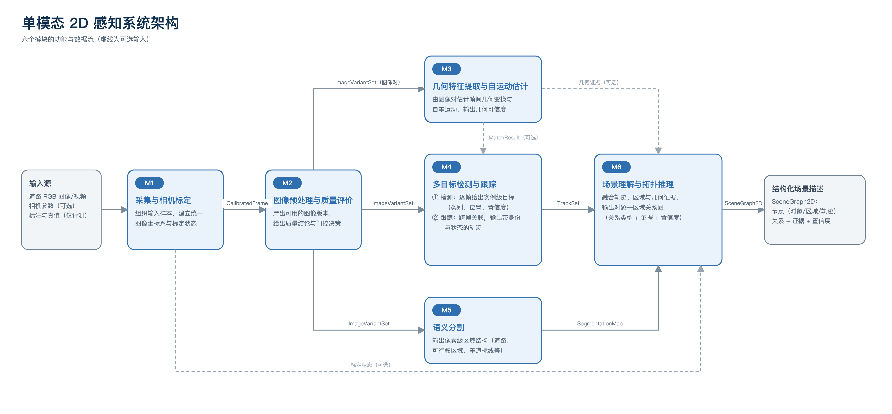

# 2DUPS · 单模态 2D 感知系统

在公开道路 RGB 图像 / 视频上离线复现单模态 2D 感知流程的课程项目仓库。



数据流：`输入 → M1 采集与标定 → M2 预处理与质量评价 →｛M3 几何 ∥ M4 目标 ∥ M5 结构｝→ M6 场景理解 → 结构化场景描述`

## 文档

| 文档 | 内容 |
|---|---|
| [系统架构](docs/architecture/01_系统架构.md) | 目标与范围、架构风格、六个模块的职责 |
| [模块规范](docs/architecture/02_模块规范.md) | 每个模块的职责、边界、输入输出、约束与验收维度 |
| [数据流与连接逻辑](docs/dataflow/03_数据流与连接逻辑.md) | 模块之间怎么连、缺了会怎样（图 1-2） |
| [接口规范](docs/interface/04_接口规范.md) | 9 个接口的字段、不变量与降级语义 |
| [实施规划](docs/architecture/05_实施规划.md) | 填充顺序、选型流程、评测体系与待填清单 |
| [方法](docs/methods/README.md) | 各模块方法说明与候选对比 |
| [图与资产](docs/figures/README.md) | 图 1-1、图 1-2（PNG + SVG） |

文档总索引见 [docs/README.md](docs/README.md)。

## 目录

```
configs/            各模块配置（一模块一份 + common.yaml）
docs/               架构、数据流、接口、方法、图
src/twodups/        代码包
scripts/            命令行入口
tests/              测试
notebooks/          实验与可视化
logs/               运行日志（不入库）
outputs/            链路输出与评测记录（不入库）
data/               数据 raw / interim / processed（不入库）
requirements.txt    依赖
pyproject.toml      包与工具配置
```

## 代码结构

```
src/twodups/
├── contracts/    接口契约 I1–I9：字段、状态枚举与大对象引用
├── modules/      六个模块，每个含 module.py（入口）与 impl_*.py（选定 / 对照实现）
├── pipeline/     编排：registry（实现注册表）+ runner（按边串联）
├── evaluation/   数据切片、模块指标与 EvaluationRecord
├── data/         数据清单（I1）读取与校验
└── utils/        配置加载与日志
```

约定：模块之间只通过 `contracts` 中的接口通信；换实现不改接口，靠配置里的 `impl` 切换。

## 开发

```bash
pip install -r requirements.txt

python scripts/check_contracts.py                                   # 打印 9 个接口与字段
python scripts/run_pipeline.py --module-config configs/m5_segmentation.yaml --dry-run
python scripts/evaluate.py --list-slices
pytest                                                              # 契约与配置冒烟测试
```

## 状态

阶段一（文献调研与系统架构设计）已完成；模块实现待开始，填充顺序见
[实施规划](docs/architecture/05_实施规划.md)。

许可：Apache License 2.0，见 [LICENSE](LICENSE)。
