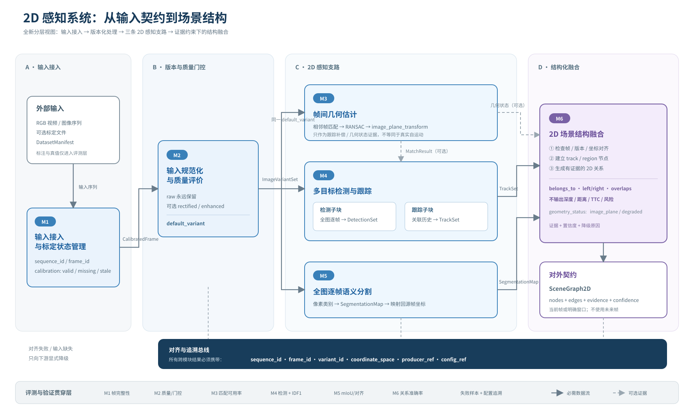

# 2DUPS · 单目 RGB 道路视频的 2D 感知原型

项目目标：离线接入视频，评价/预处理图像，逐步实现帧间几何、检测跟踪、语义分割与可审计的 **2D** 场景关系。不是自动驾驶控制或 3D 风险系统。



当前只有 BDD100K 五段样本 DataLoader 与 M2 简单增强可以跑通。M1 通用标定、M3–M6、完整 `run_pipeline.py` 和正式评测仍未实现；不要把配置里的候选算法当成已有功能。

## 开始开发

每位成员在**自己的 Linux 服务器**上分别 clone 仓库、创建项目专用环境并获取数据；不依赖其他成员的服务器、Conda 环境或文件目录。首次使用：

```bash
git clone https://github.com/saturn756/2DUPS.git
cd 2DUPS
conda env create -f environment.yml
conda activate 2dups
python -m pip install -r requirements-lock-linux-py311.txt
python -m pip install --no-deps -e .
python -m pip check
python -m pytest -q
```

获取 5 段 BDD100K 视频和 JSON 的确切命令见[样本说明](docs/datasets/08_BDD100K_五段小样本.md)。数据放在 `data/raw/bdd100k/`，不进入 Git；取得后先验证：

```bash
sha256sum -c configs/datasets/bdd100k-five.sha256
python scripts/run_dataloader.py --sample-id 359ce11c-e2f58b33 --max-frames 30
python scripts/run_m2.py --sample-id 359ce11c-e2f58b33 --max-frames 20
```

完整检查可运行 `python scripts/run_dataloader.py`（5 段视频）和 `python scripts/run_m2.py --max-frames 320 --stride 100`（抽帧）。M2 PNG/报告写在被忽略的 `outputs/m2/`。`python scripts/run_pipeline.py --module-config configs/m2_preprocess.yaml --dry-run` **只解析配置**。

## 只维护这几处约定

| 目的 | 权威位置 |
|---|---|
| Agent/协作者应读什么、改什么、怎么验证 | [AGENTS.md](AGENTS.md) |
| 系统范围、六个模块、数据流和降级 | [模块规范](docs/architecture/02_模块规范.md) |
| I1–I9 字段、JSON 示例和不变量 | [接口规范](docs/interface/04_接口规范.md) + `src/twodups/contracts/` |
| 环境、数据、checkpoint 和共享参数 | [协作与复现规范](docs/team/01_协作开发与复现规范.md) |
| 现用数据集文件与下载方法 | [BDD100K 五段样本](docs/datasets/08_BDD100K_五段小样本.md) |
| 当前模块参数 | `configs/`；不要从历史调研或图示反推参数 |

`docs/reference/` 是非规范性的历史调研。权重放 `checkpoints/`，数据放 `data/`，运行结果放 `outputs/`/`runs/`；它们都不提交到 GitHub。修改接口时必须同时修改契约代码、示例与测试。

许可证见 [LICENSE](LICENSE)。
