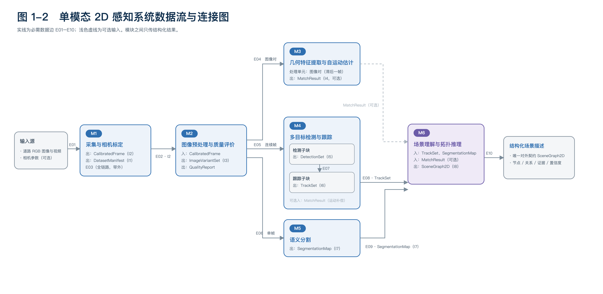

# 2DUPS · 单模态 2D 感知系统

《机器视觉》课程项目（2024 级）的工程仓库。目标是在**公开道路 RGB 图像 / 视频**上离线复现一条完整的单模态 2D 感知流程：
从相机标定与图像预处理，到 2D 目标检测与多目标跟踪、语义分割与场景拓扑推理，并保证每个环节可独立评测、可替换实现、失败可追溯。

本仓库当前承载**阶段一（文献调研与系统架构设计）**的架构产出：系统架构图、数据流与连接逻辑、接口规范与模块规范。

---

## 一、系统架构（图 1-1）


数据流：`输入 → M1 采集与相机标定 → M2 图像预处理与质量评价 →｛M3 几何 ∥ M4 目标 ∥ M5 结构｝→ M6 场景理解与拓扑推理 → 结构化场景描述`

- M3、M4、M5 的输入同为 M2 产出的**同一图像版本**，三条支路彼此不构成前置依赖；
- M6 是唯一的汇合点，也是唯一的对外结构化输出；
- 另有贯穿全链路的**评测与验证**：按数据切片汇总指标并把失败归因到模块与子块（不产出被下游消费的数据）。

### 六个模块

| 模块 | 职责 | 输出接口 | 预定实现 |
|---|---|---|---|
| M1 道路图像采集与相机标定 | 组织输入样本，建立统一坐标系与标定状态 | DatasetManifest、CalibratedFrame | OpenCV 张氏平面标定 + cv2.undistort |
| M2 图像预处理与质量评价 | 产出可用图像版本，给出质量结论与门控决策 | ImageVariantSet、QualityReport | Zero-DCE Tiny（低照度）+ CLAHE（基线） |
| M3 几何特征提取与自运动估计 | 由图像对估计帧间几何变换与可信度 | MatchResult | SIFT + FLANN + RANSAC |
| M4 多目标检测与跟踪 | 单帧实例级目标感知 + 跨帧身份关联与轨迹管理 | DetectionSet、TrackSet | YOLOv12-N + ByteTrack（UCMCTrack 相机运动补偿） |
| M5 语义分割 | 输出像素级区域结构（道路、可行驶区域、车道标线等） | SegmentationMap | PIDNet-S（Cityscapes 预训练） |
| M6 场景理解与拓扑推理 | 融合轨迹、区域与几何证据，输出对象—区域关系图 | SceneGraph2D | 规则化 2D 场景图 |

M4 内含**检测**与**跟踪**两个子块，模块边界对外不变；检测指标与跟踪指标必须分开统计。

---

## 二、数据流与接口（图 1-2）



图中实线为必需数据边 **E01–E10**；M3 的 `MatchResult` 是可选输入，用浅色虚线表示。

### 必需数据边

| 边 | 源 → 目标 | 承载接口 | 说明 |
|---|---|---|---|
| E01 | 输入源 → M1 | （外部输入） | 图像 / 视频序列、相机参数（可选）、来源与许可信息 |
| E02 | M1 → M2 | CalibratedFrame | 带坐标系与标定状态的帧；M2 只做内容处理，不改几何 |
| E03 | M1 → 全链路 | DatasetManifest | 带外初始化：版本、切分、切片标签，先于任何样本处理 |
| E04 / E05 / E06 | M2 → M3 / M4 / M5 | ImageVariantSet | 同一帧的同一图像版本分发给三条并列支路 |
| E07 | M4 检测子块 → 跟踪子块 | DetectionSet | 模块内部边；同时对外可读，供单独评测检测 |
| E08 | M4 跟踪子块 → M6 | TrackSet | 轨迹与状态 |
| E09 | M5 → M6 | SegmentationMap | 像素级区域结构 |
| E10 | M6 → 对外输出 | SceneGraph2D | 唯一对外结构化契约 |

### 九个接口

| 接口 | 生产 → 消费 | 关键落点 |
|---|---|---|
| I1 DatasetManifest | M1 → 全链路 | 运行级清单：版本、切分、来源与许可、切片标签 |
| I2 CalibratedFrame | M1 → M2（M6 可选） | 坐标系标识 + 标定状态三态（有效 / 缺失 / 过期） |
| I3 ImageVariantSet / QualityReport | M2 → M3、M4、M5 | 图像版本集合 + 门控决策与理由 |
| I4 MatchResult | M3 → M4 跟踪子块、M6（可选） | 对应关系、内点、几何变换、状态与可信度 |
| I5 DetectionSet | M4 检测子块 → 跟踪子块（对外可读） | 类别、位置、置信度 |
| I6 TrackSet | M4 跟踪子块 → M6 | 轨迹身份、状态与关联依据 |
| I7 SegmentationMap | M5 → M6 | 类别图 + 类别模式引用 |
| I8 SceneGraph2D | M6 → 对外输出 | 节点、关系、证据、geometry_status、missing_inputs |
| I9 EvaluationRecord | 评测与验证 → 归档 / 报告 | 切片指标与失败归因，可追溯到模块与样本 |

### 强制随行字段与降级语义

- **四个必答**：哪一帧（`frame_id`）、哪个图像版本（`variant_id`）、哪个实现与配置（`producer_ref` / `config_ref`）、哪个标定状态（`calibration` / `geometry_status`）；
- **失败显式**：一律用 `status` / `state` / `missing_inputs` 表达，不用缺省值或空值掩盖；
- **只传结构化结果**：大对象（图像、掩码、点集）用引用传递，不传高维特征张量；类别语义必须经类别模式（`class_schema_ref`）显式映射；
- **降级只向下游单向传播**：标定缺失时只输出图像平面关系；几何不可靠时跟踪不补偿、M6 不用几何证据；任一输入缺失时等待或降级并列出缺失项，**不得用其它帧或版本顶替**。

---

## 三、目录结构

```
2DUPS/
├── README.md
├── LICENSE
└── docs/
    ├── architecture/          架构设计与接口规范（模块、数据流、接口、规划）
    │   ├── README.md
    │   ├── 01_系统架构.md
    │   ├── 02_模块规范.md
    │   ├── 03_数据流与连接逻辑.md
    │   ├── 04_接口规范.md
    │   └── 05_实施规划.md
    └── figures/               图 1-1、图 1-2（PNG + SVG）
```

## 四、文档阅读顺序

1. 先看 **图 1-1**（模块与数据流），再看 **图 1-2**（边与接口）；
2. `01_系统架构.md`：目标与范围、架构风格、六模块职责总览；
3. `03_数据流与连接逻辑.md`：模块之间怎么连、缺了会怎样、失败如何传播；
4. `02_模块规范.md`、`04_接口规范.md`：做实现时查职责、输入输出与字段不变量；
5. `05_实施规划.md`：填充顺序、选型流程、评测体系与待填清单。

改动顺序规则：**模块职责变 → 先改 01/02；连接变 → 先改 03；字段变 → 改 04**，图与下游材料随后同步。

## 五、当前状态

| 阶段 | 内容 | 状态 |
|---|---|---|
| 阶段一 | 文献调研与系统架构设计 | 已完成：图 1-1 / 图 1-2、数据流与接口设计、模块规范、架构决策文档、文献调研报告与文献调研表 |
| 阶段二 | 道路图像采集与相机标定 | 待开始 |
| 阶段三 | 图像增强与去噪质量评价 | 待开始 |
| 阶段四 | 特征检测、SIFT 匹配、2D 目标检测 | 待开始 |
| 阶段五 | 2D 语义分割与场景拓扑推理 | 待开始 |
| 阶段六 | 系统集成、测试与安全分析 | 待开始 |

## 六、许可

Apache License 2.0，见 [LICENSE](LICENSE)。
